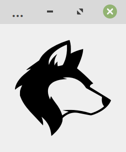
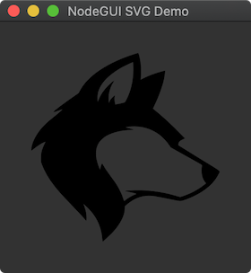

# nodegui-plugin-svg

[](https://www.npmjs.com/package/nodegui-plugin-svg)

Plugin for NodeGUI that allows to work with QSvgWidget

<p align="center">

&nbsp;
&nbsp;

</p>

## Warning

Windows support is not yet implemented. Stay tuned!

## Installation

```sh
npm install nodegui-plugin-svg
```

## Usage

```javascript
import {
  QMainWindow,
  QWidget,
  FlexLayout,
} from '@nodegui/nodegui';
import { QSvgWidget } from 'nodegui-svg-widget';

const win = new QMainWindow();
const rootView = new QWidget();
const svg = new QSvgWidget();

rootView.setObjectName("root");
rootView.setLayout(new FlexLayout());
svg.setObjectName("svg");

if (rootView.layout) {
  rootView.layout.addWidget(svg);
}

win.setCentralWidget(rootView);
win.setStyleSheet(`
  #root {
    flex: 1;
    height: '100%';
    align-items: 'center';
    justify-content: 'center';
  }

  #svg {
    width: 192px;
    height: 192px;
  }
`);

win.show();
global.win = win;
```
